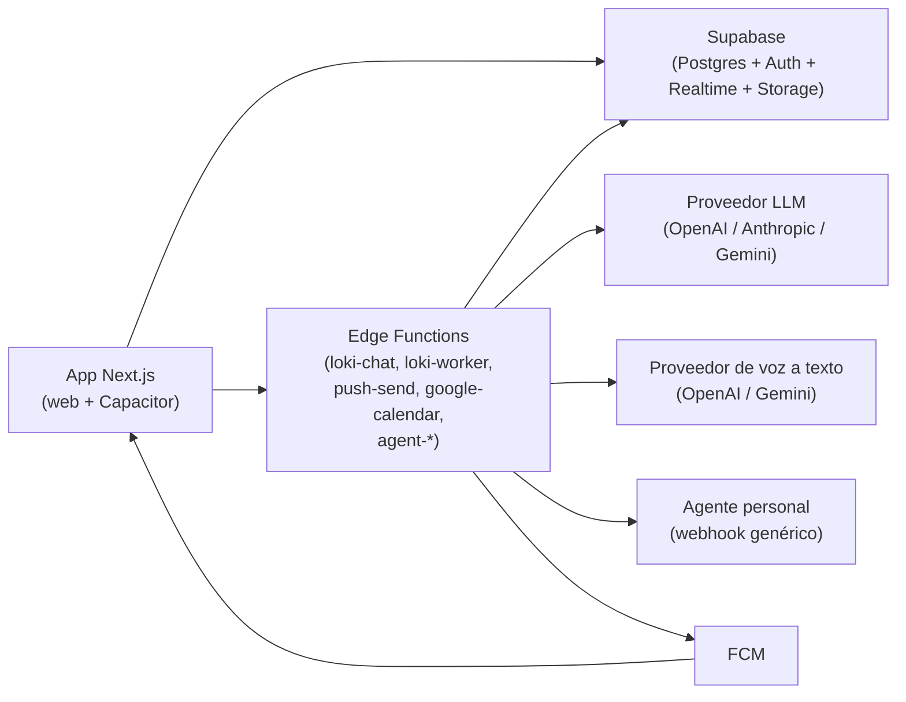

# Loki

App familiar (Next.js 15 con export estático + Capacitor, TypeScript estricto,
Tailwind, shadcn/ui): espacios, chats en vivo, publicaciones, hilos,
reacciones, menciones, notas de voz con transcripción, encuestas en el chat y
Loki IA. Diseño claro estilo Grok Bot.

## Arquitectura

| Pieza | Dónde | Notas |
|---|---|---|
| App web / móvil | `src/` (Next.js App Router) | Export estático (`output: "export"` con `BUILD_TARGET=capacitor`); sin SSR ni cookies de servidor |
| Base de datos, auth, realtime, storage | Supabase local (Postgres + RLS + Realtime + Storage) | `supabase/`; detalle en [`supabase/README.md`](supabase/README.md) |
| Loki IA real | Edge Function `supabase/functions/loki-chat` (Deno) | Proveedor por entorno; sin clave responde 503 y la UI muestra "Loki IA sin configurar" |
| Agentes personales | Edge Functions `agent-connections`, `agent-dispatch`, `agent-callback` (Deno) | Contrato en [`docs/AGENTES.md`](docs/AGENTES.md); sin `AGENT_TOKEN_KEY` la UI muestra "Agentes sin configurar" |
| IA por trabajos (resúmenes, transcripción) | `ai_jobs` + Edge Function `supabase/functions/loki-worker` (Deno) | Por eventos: un insert → trigger → `pg_net` → la función se despierta → Realtime. Nada escuchando 24/7 |
| Voz a texto | `supabase/functions/_shared/transcribe.ts` (lo usa `loki-worker`) | `STT_PROVIDER=openai` o `gemini`; sin clave la UI muestra "Transcripción sin configurar" |
| Push | Firebase **solo** para FCM en el cliente (`src/lib/push/fcm.ts`, `src/lib/push/native.ts`) + Edge Function `supabase/functions/push-send` | Sin config, "Notificaciones no configuradas en este entorno" |
| Tipos UI | `src/types/` (camelCase) | El adaptador `src/lib/data/*` traduce el snake_case de Postgres |

Firebase no guarda datos: ni Firestore, ni Auth, ni Storage quedan en `src/`.



## Estado actual

- **Adjuntos y voz (funcionando de punta a punta)**: el menú `+` ofrece foto/
  video, cámara, archivo y nota de voz. Cada archivo se sube a los buckets
  privados `chat-media` y `post-media` (ruta `{workspace_id}/…`, RLS por
  espacio) con progreso real y cancelación, y se ve en el chat y en las
  publicaciones. `MediaRecorder` elige el MIME que soporte el navegador
  (webm/opus en Chrome, mp4 en Safari); en el chat, mantener para grabar y
  deslizar para cancelar; en escritorio, click para empezar y parar.
- **Transcripción de notas de voz (bajo demanda)**: cada nota de voz tiene
  "Ver transcripción", en el chat, en los hilos y también en las publicaciones
  (bucket `post-media`). Nada se transcribe hasta que alguien la abre: ahí se
  encola **un** trabajo en `ai_jobs`, el trigger `wake_ai_worker` despierta a
  `loki-worker` por `pg_net` y el texto llega por Realtime. La tabla
  `audio_transcriptions` guarda texto, idioma, duración, proveedor y estado; un
  archivo, una transcripción (no se vuelve a pagar). La visibilidad es la del
  mensaje (en un DM, solo sus miembros). Si el espacio llegó a su límite de IA,
  el audio no sale del servidor y la UI avisa del límite.
- **Voz a acción**: el micrófono del chat con Loki y la acción rápida "Dictar a
  Loki" graban, transcriben y mandan el texto al mismo flujo que escribirlo a
  mano (analizador determinista primero, modelo después). La transcripción se
  muestra **siempre** encima de la tarjeta de plan, editable, con "Recalcular
  con este texto" para corregir errores de dictado antes de confirmar.
- **Convertir una nota de voz**: "Convertir en…" (tarea, evento o
  recordatorio) sobre un mensaje con audio transcribe primero y usa la
  transcripción como texto.
- **Búsqueda universal**: Cmd/Ctrl+K (escritorio) o la lupa → `/buscar`
  (móvil) busca en mensajes, **notas de voz transcritas**, **archivos e
  imágenes (por nombre y por texto OCR)**, **listas e ítems**,
  **encuestas**, **ideas**, **recuerdos del espacio**, tareas, proyectos,
  eventos y personas. Filtros por tipo (chips), `de: Sofi`, `en: General`,
  `solo míos` y fechas (`la semana pasada`), "ver más" paginado y botón
  **Preguntar a Loki** al final (responde con los resultados como contexto,
  nunca automático).
- **Texto en imágenes (opcional, por espacio)**: con el OCR activado en
  Configuración, cada foto subida se lee sola con el modelo de visión y su
  texto queda indexado. Cuesta cuota de IA; sin configurar, las imágenes se
  encuentran por nombre.
- **Encuestas en el chat** (decidir sin 40 mensajes): desde el `+` del
  composer, desde Acciones rápidas o pidiéndoselo a Loki ("haz una encuesta
  para elegir el día del asado entre viernes y sábado", que además funciona
  sin modelo). La encuesta es un mensaje tarjeta con barras en vivo, avatares
  de quién votó, quién falta y cambio de voto mientras esté abierta; los
  comentarios son el hilo del mensaje. Tipos: una opción, varias, sí/no y
  **elegir fecha** (cada opción muestra cuántos están ocupados, sin el
  detalle del evento). Al cerrar: el resultado queda fijado, un empate lo
  decide quien la creó, y sale "Crear evento" (con la franja ganadora y los
  votantes como invitados) o "Crear tarea" en las aprobaciones. Ajustes:
  anónima, sugerencias, fecha de cierre y quién puede cerrar; con recordatorio
  opcional a quien no votó. "Resumir con Loki" solo bajo demanda (trabajo
  `poll_summary`, modelo barato, cuota del espacio).
- **Memoria del espacio** (`/memoria`): lo que el espacio recuerda y que Loki
  usa al responder. Se guarda **solo por acción explícita**: "Loki, recuerda
  que…" (detectado sin IA), la opción "Recordar en el espacio" del menú de un
  mensaje, el botón de cada punto del resumen de no leídos o la pantalla
  Memoria con buscador. Consultarlo ("¿cuál era la clave del wifi?") es
  **full-text en español** (como la búsqueda global, sin costo de IA) y la
  respuesta cita el recuerdo y quién lo guardó. Categorías: salud, casa,
  contactos, trabajo y otros; con fijar, editar, borrar y fecha de caducidad
  opcional ("el código del portón cambia en marzo"). Un recuerdo marcado como
  **sensible** (claves, datos de salud) sale oculto hasta que alguien pulse
  "Mostrar", no aparece en el push ni en la búsqueda global, y nunca entra en
  un resumen; lo que sale de un DM nace "solo yo" hasta que quien lo guarda lo
  confirme. En móvil se desliza para borrar y se mantiene pulsado para editar;
  en escritorio, acciones al hover y atajos (Supr borra, Espacio fija).
- **Loki IA**: chat privado y @Loki en los chats de grupo, con streaming real,
  planes multi-acción con confirmación, recordatorios, ítems de lista, avisos,
  encuestas y barra de deshacer. Cuota por espacio visible en Configuración.
- **Push**: insertar en `public.notifications` dispara el push (trigger
  `maybe_push_notification` → `pg_net` → `push-send`, que respeta
  `notification_prefs` y el horario de silencio). Web (Service Worker) y
  Android (FCM nativo) con alternativa clara cuando no hay config.
- **Resumen diario "Tu día"**: cada mañana llega una push tipo `daily` con tu
  día (la arma `create_daily_digests()` en la base, pg_cron cada 15 min, SQL
  barato sin LLM, a tu hora local con la zona de `daily_digest_prefs` que no
  se corre con el horario de verano) y al tocarla abre `/inicio?vista=dia`:
  eventos de hoy, tareas que vencen/atrasadas, listas fijadas con pendientes,
  encuestas por votar y destacados con IA bajo demanda (`day_highlights`,
  modelo barato, cuota del espacio, cacheado por día). Preferencias en
  Configuración → Notificaciones → Resumen diario.

## Requisitos

- Node 22+ en Windows.
- **WSL2 Ubuntu con Docker Engine** (no hace falta Docker Desktop): el CLI de
  Supabase corre dentro de WSL vía el wrapper `scripts/supabase.mjs`.
- Puertos libres: 54321 (API), 54322 (Postgres), 54324 (Mailpit).

## Supabase local

```bash
npm run sb:start    # arranca el stack (sin servicios pesados por la RAM)
npm run sb:status   # estado y claves de demo
npm run sb:reset    # recrea la base y aplica las migraciones
npm run sb:stop     # para el stack
```

## Variables (`.env.local`, gitignored)

```bash
NEXT_PUBLIC_SUPABASE_URL=http://127.0.0.1:54321
NEXT_PUBLIC_SUPABASE_ANON_KEY=<ANON_KEY de npm run sb:status>
```

Solo la clave **pública** (el aislamiento lo pone la RLS). La `service_role`
nunca va en `NEXT_PUBLIC_` ni en el cliente. Ver `.env.example`.

## Edge Functions

```bash
npm run sb:functions   # sirve supabase/functions en local
```

Secretos en `supabase/functions/.env` (gitignored; ver
`supabase/functions/.env.example`):

| Variable | Para qué |
|---|---|
| `LLM_PROVIDER`, `LLM_MODEL`, `LLM_MODEL_FAST`, `LLM_MODEL_SMART`, `LLM_API_KEY`, `LLM_BASE_URL` | Loki IA (`loki-chat`, `loki-worker`) |
| `STT_PROVIDER`, `STT_MODEL`, `STT_API_KEY`, `STT_BASE_URL` | Voz a texto de notas de voz y dictado |
| `OCR_PROVIDER`, `OCR_MODEL`, `OCR_API_KEY`, `OCR_BASE_URL` | Texto en imágenes (vacío = reutiliza la config del LLM) |
| `WORKER_KEY` | Clave interna que valida el trigger `wake_ai_worker` (mismo valor que `loki.worker_key` en la base) |
| `FCM_SERVICE_ACCOUNT` | Push (FCM) |
| `GOOGLE_CLIENT_ID`, `GOOGLE_CLIENT_SECRET`, `GOOGLE_REDIRECT_URL`, `GOOGLE_TOKEN_KEY` | Google Calendar |
| `AGENT_TOKEN_KEY`, `AGENT_DISPATCH_KEY`, `AGENT_PUBLIC_FUNCTIONS_URL`, `AGENT_ALLOW_PRIVATE` | Agentes personales (`agent-connections`, `agent-dispatch`, `agent-callback`; ver `docs/AGENTES.md`) |

Sin `LLM_API_KEY`, `loki-chat` responde 503 `{code:'not_configured'}`. Sin
`STT_API_KEY`, `loki-worker` responde `{"stt":{"configured":false}}` y la UI
muestra "Transcripción sin configurar" **sin encolar nada**.

Proveedores de voz a texto soportados (verificados contra su documentación
oficial, sin inventar parámetros):

- `STT_PROVIDER=openai` → `POST {STT_BASE_URL}/audio/transcriptions`
  (multipart: `file`, `model`, `response_format=json`; `language` solo con
  modelos `whisper-*`, porque los `gpt-*-transcribe` lo detectan solos y lo
  rechazan). Compatible con Groq, OpenRouter, Ollama y otros
  OpenAI-compatible. Modelo por defecto: `gpt-4o-mini-transcribe`.
  Ref: <https://platform.openai.com/docs/api-reference/audio/createTranscription>
- `STT_PROVIDER=gemini` → `POST {base}/v1beta/models/{model}:generateContent`
  con el audio en `parts[].inline_data` (`mime_type` + base64) y un prompt de
  transcripción literal, `temperature: 0`. Modelo por defecto:
  `gemini-2.0-flash`. Refs:
  <https://ai.google.dev/api/generate-content> ·
  <https://ai.google.dev/gemini-api/docs/audio>

## Scripts de test

```bash
npm run typecheck   # tsc --noEmit
npm run lint        # eslint .
npm run check-env   # valida env sin imprimir secretos
npm run build       # next build
npm run build:capacitor  # export estático para Capacitor
npm run test:unit   # parser de menciones + preview del chat + intent (Node, sin runner)
npm run test:rls    # tests de RLS contra Supabase local (necesita sb:start)
```

## Android (Capacitor)

App nativa (`cl.loki.app`) sobre el export estático (`out/`). El proyecto
`android/` ya existe (generado con `npx cap add android`); si se borra, ese
comando lo regenera completo y `npm run build:capacitor` vuelve a copiar el
export con `npx cap sync android`.

```bash
npm run icons              # genera public/icons/*.png (una vez o al cambiar el SVG)
npm run build:capacitor    # next build (export) + cap sync android
```

Abrir `android/` en Android Studio, esperar el sync de Gradle y compilar:

- APK debug: `Build > Build APK(s)` o `./gradlew assembleDebug` (sale en
  `android/app/build/outputs/apk/debug/`).
- Instalar en un dispositivo con depuración USB o copiar el APK.

Deep links a `/invite` (ver `src/components/pwa/deep-links.tsx`): el
`AndroidManifest` trae `intent-filter` para `https://loki.cl/invite?code=...`
(App Link) y `loki://invite?code=...` (scheme propio). Para que el App Link
abra la app hay que publicar `https://loki.cl/.well-known/assetlinks.json`
con el `package_name` `cl.loki.app` y la huella SHA-256 del keystore.

### Micrófono en Android

`android/app/src/main/AndroidManifest.xml` declara `RECORD_AUDIO` y
`MODIFY_AUDIO_SETTINGS`, más `<uses-feature android:name="android.hardware.microphone"
android:required="false"/>` para que la app siga instalándose en equipos sin
micrófono. El `BridgeWebChromeClient` de Capacitor 8 ya reenvía
`android.webkit.resource.AUDIO_CAPTURE` a la petición de permiso en tiempo de
ejecución, así que `getUserMedia({ audio: true })` funciona dentro de la WebView
sin plugin extra. Si el usuario lo niega, la UI lo dice y da la ruta exacta
para reactivarlo (Ajustes → Apps → Loki → Permisos → Micrófono), y siempre
queda la alternativa de subir un archivo de audio.

Nota: `getUserMedia` solo existe en contexto seguro. En `http://` que no sea
`localhost` el navegador no da micrófono; la app usa el esquema `https` de
Capacitor (`server.androidScheme`), así que en el dispositivo no pasa.

Push nativo (FCM, ver `src/lib/push/native.ts`): descargar el
`google-services.json` de la consola de Firebase y ponerlo en `android/app/`
(sin subirlo al repo, está gitignored). Sin ese archivo el push nativo no
registra token; el push web sigue usando `src/lib/push/fcm.ts`.

## Qué falta

- **Clave de LLM**: sin `LLM_API_KEY` solo funciona el camino "sin configurar"
  (más la vía determinista, que es código, no IA).
- **Clave de voz a texto**: sin `STT_API_KEY` las notas de voz se escuchan pero
  no se transcriben, y "Dictar a Loki" avisa "Transcripción sin configurar".
- **FCM real**: falta el `google-services.json` en `android/app/` para el push
  nativo; el web necesita su config en `.env.local`.
- **Capacitor en dispositivo**: falta probar en un teléfono real (barra de
  estado, teclado, micrófono y push).
