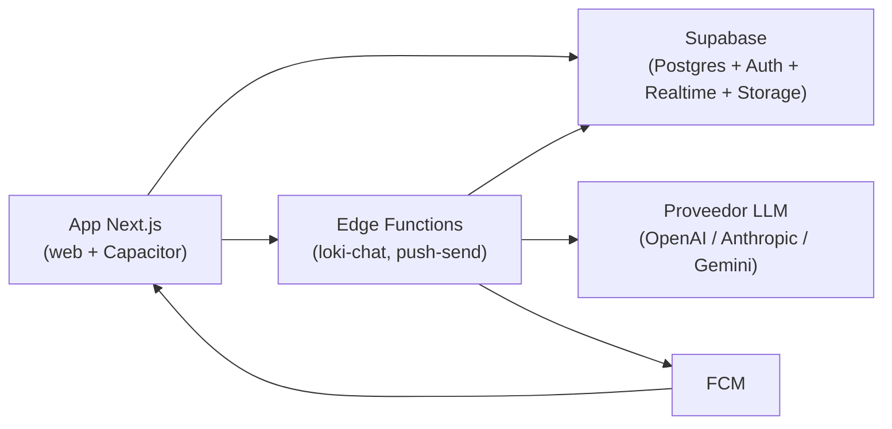

# Loki

App familiar (Next.js 15 con export estático + Capacitor, TypeScript estricto,
Tailwind, shadcn/ui): espacios, chats en vivo, publicaciones, hilos,
reacciones, menciones y Loki IA. Diseño claro estilo Grok Bot.

## Arquitectura

| Pieza | Dónde | Notas |
|---|---|---|
| App web / móvil | `src/` (Next.js App Router) | Export estático (`output: "export"` con `BUILD_TARGET=capacitor`); sin SSR ni cookies de servidor |
| Base de datos, auth, realtime, storage | Supabase local (Postgres + RLS + Realtime + Storage) | `supabase/`; detalle en [`supabase/README.md`](supabase/README.md) |
| Loki IA real | Edge Function `supabase/functions/loki-chat` (Deno) | Proveedor por entorno; sin clave responde 503 y la UI muestra "Loki IA sin configurar" |
| Push | Firebase **solo** para FCM en el cliente (`src/lib/push/fcm.ts`) + Edge Function `supabase/functions/push-send` (desactivada por defecto) | Sin config, "Notificaciones no configuradas en este entorno" |
| Tipos UI | `src/types/` (camelCase) | El adaptador `src/lib/data/*` traduce el snake_case de Postgres |

Firebase no guarda datos: ni Firestore, ni Auth, ni Storage quedan en `src/`.



## Estado actual (T34–T36)

- **Pulido**: tokens unificados (espaciado 4–32, radios 8/12/16/24/pill,
  Inter 13/15/17/20/28, lucide 1.75), estados vacíos con acción, skeletons
  y reintento en todas las listas, menú único de mensaje (long-press 500ms
  + click derecho: emojis arriba, acciones abajo), todo en español.
- **Calidad y seguridad**: ARIA/foco/contraste AA, ventanas virtuales en
  chat y feed, code splitting (búsqueda, visor, diálogos), 10 archivos de
  tests RLS (incluye `negatives.test.mjs`), rate limiting en Edge
  (30 req/min, 429 en español), validadores estrictos, texto seguro
  (enlaces solo http/https), CSP, error boundaries por sección y logger
  local. CI en `.github/workflows/ci.yml`.
- **Lanzamiento**: [`docs/DEPLOY.md`](docs/DEPLOY.md), `.env.example`
  completo, `npm run check-env`, página `/legal`, onboarding de 3 pasos y
  [`docs/demo-seed.sql`](docs/demo-seed.sql) (plantilla sin ejecutar).

## Requisitos

- Node 22+ en Windows.
- **WSL2 Ubuntu con Docker Engine** (no hace falta Docker Desktop): el CLI de
  Supabase corre dentro de WSL vía el wrapper `scripts/supabase.mjs`.
- Puertos libres: 54321 (API), 54322 (Postgres), 54324 (Mailpit).

## Supabase local

```bash
npm run sb:start    # arranca el stack (sin servicios pesados por la RAM)
npm run sb:status   # estado y claves de demo
npm run sb:reset    # recrea la base y aplica las migraciones
npm run sb:stop     # para el stack
```

## Variables (`.env.local`, gitignored)

```bash
NEXT_PUBLIC_SUPABASE_URL=http://127.0.0.1:54321
NEXT_PUBLIC_SUPABASE_ANON_KEY=<ANON_KEY de npm run sb:status>
```

Solo la clave **pública** (el aislamiento lo pone la RLS). La `service_role`
nunca va en `NEXT_PUBLIC_` ni en el cliente. Ver `.env.example`.

## Edge Functions

```bash
npm run sb:functions   # sirve supabase/functions en local
```

Secretos en `supabase/functions/.env` (gitignored; ver
`supabase/functions/.env.example`): `LLM_PROVIDER=openai|anthropic|gemini`,
`LLM_MODEL`, `LLM_API_KEY`, `LLM_BASE_URL` (Loki IA) y `FCM_SERVICE_ACCOUNT`
(push). Sin `LLM_API_KEY`, `loki-chat` responde 503 `{code:'not_configured'}`.

## Scripts de test

```bash
npm run typecheck   # tsc --noEmit
npm run lint        # eslint .
npm run check-env   # valida env sin imprimir secretos
npm run build       # next build
npm run build:capacitor  # export estático para Capacitor
npm run test:unit   # parser de menciones + preview del chat (Node, sin runner)
npm run test:rls    # 55 tests de RLS contra Supabase local (necesita sb:start)
```

## Android (Capacitor)

App nativa (`cl.loki.app`) sobre el export estático (`out/`). El proyecto
`android/` ya existe (generado con `npx cap add android`); si se borra, ese
comando lo regenera completo y `npm run build:capacitor` vuelve a copiar el
export con `npx cap sync android`.

```bash
npm run icons              # genera public/icons/*.png (una vez o al cambiar el SVG)
npm run build:capacitor    # next build (export) + cap sync android
```

Abrir `android/` en Android Studio, esperar el sync de Gradle y compilar:

- APK debug: `Build > Build APK(s)` o `./gradlew assembleDebug` (sale en
  `android/app/build/outputs/apk/debug/`).
- Instalar en un dispositivo con depuración USB o copiar el APK.

Deep links a `/invite` (ver `src/components/pwa/deep-links.tsx`): el
`AndroidManifest` trae `intent-filter` para `https://loki.cl/invite?code=...`
(App Link) y `loki://invite?code=...` (scheme propio). Para que el App Link
abra la app hay que publicar `https://loki.cl/.well-known/assetlinks.json`
con el `package_name` `cl.loki.app` y la huella SHA-256 del keystore.

Push nativo (FCM, ver `src/lib/push/native.ts`): descargar el
`google-services.json` de la consola de Firebase y ponerlo en `android/app/`
(sin subirlo al repo, está gitignored). Sin ese archivo el push nativo no
registra token; el push web sigue usando `src/lib/push/fcm.ts`.

## Qué falta

- **Push de verdad**: `push-send` está desactivada (ningún trigger la llama).
  Para activarla hay que cablear `pg_net`/webhook sobre mensajes nuevos y
  poner `FCM_SERVICE_ACCOUNT`, además de las claves web + VAPID en
  `.env.local` para registrar el token desde Configuración.
- **Clave de LLM**: sin `LLM_API_KEY` solo funciona el camino "sin configurar".
- **Adjuntos**: la UI de adjuntos sigue deshabilitada (buckets listos).
- **Códigos de invitación**: el onboarding solo crea espacios; unirse con
  código sigue pendiente.
