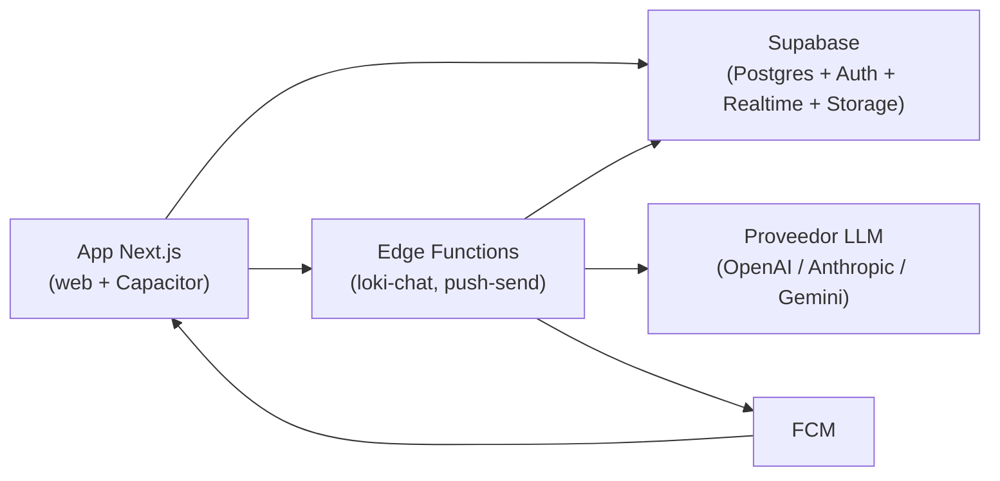

# Despliegue de Loki (T36)

> Solo documentación: ningún paso se ejecuta solo. No hay secretos aquí;
> los nombres de variables están en [`.env.example`](../.env.example) y
> [`supabase/functions/.env.example`](../supabase/functions/.env.example).



## 1. Crear el Supabase real y aplicar migraciones

1. Crea el proyecto en el panel de Supabase y anota `URL` + `anon key`.
2. Instala el CLI (`supabase/cli`) e inicia sesión.
3. Vincula y sube el esquema:
   ```bash
   supabase link --project-ref <REF>
   supabase db push   # aplica supabase/migrations en orden
   ```
4. Comprueba en el panel que existen las tablas (`workspaces`, `messages`,
   `events`, `tasks`, `projects`, `invites`, …) y los buckets (`chat-media`,
   `post-media`, `avatars`).

## 2. Auth: email + Google OAuth

- **Email**: activado por defecto; desactiva la confirmación solo en local
  (`supabase/config.toml` ya trae `enable_confirmations=false`).
- **Google**: en el panel (Authentication → Providers) crea el cliente OAuth
  de Google y registra las URLs de retorno:
  - Local: `http://localhost:3000`, `http://127.0.0.1:54321/auth/v1/callback`
  - Producción: tu dominio (`https://<tu-dominio>/auth/callback`) y el
    callback del proyecto (`https://<REF>.supabase.co/auth/v1/callback`).

## 3. Secretos de las Edge Functions

En el panel (Edge Functions → Secrets) o con `supabase secrets set`:

- Loki IA: `LLM_PROVIDER` (`openai|anthropic|gemini`), `LLM_MODEL`,
  `LLM_API_KEY`, `LLM_BASE_URL` (solo compatibles OpenAI), `AI_DAILY_LIMIT`
  (default 50). Sin `LLM_API_KEY`: 503 `not_configured`.
- Push: `FCM_SERVICE_ACCOUNT` (JSON de la cuenta de servicio). Sin él:
  503 `not_configured`.
- Despliega con `supabase functions deploy loki-chat` y
  `supabase functions deploy push-send`.

## 4. pg_cron (recordatorios y limpieza)

Activa la extensión `pg_cron` en el proyecto y programa los trabajos que
necesites (p. ej. aviso de `tasks.reminder_at`, purga de typing antiguo).
Los jobs viven en la base real, no en el repo: documéntalos en tu panel.

## 5. Firebase solo para FCM

Firebase **no guarda datos** (sin Firestore/Auth/Storage en la app):

1. Crea el proyecto, activa Cloud Messaging y descarga el JSON de la
   cuenta de servicio → secreto `FCM_SERVICE_ACCOUNT`.
2. Copia las claves web + VAPID a `.env.local` / al hosting
   (`NEXT_PUBLIC_FIREBASE_*`, ver `.env.example`).
3. El push es opt-in: la app solo registra el token con
   `NEXT_PUBLIC_PUSH_ENABLED=1`.

## 6. Frontend: Vercel o Firebase Hosting (build export)

- **Vercel**: importa el repo, pon `NEXT_PUBLIC_SUPABASE_URL` y
  `NEXT_PUBLIC_SUPABASE_ANON_KEY` (+ Firebase web si hay push) y despliega
  (`npm run build`).
- **Firebase Hosting**: `npm run build` y publica el export (`out/`,
  ver `firebase.json`). Sin SSR: todo es estático + Supabase cliente.

## 7. Firma del APK/AAB (Android, `cl.loki.app`)

1. Genera el keystore una vez (fuera del repo, con backup):
   ```bash
   keytool -genkeypair -alias loki -keyalg RSA -keysize 2048 -validity 10000 -keystore loki.keystore
   ```
2. Configura `android/key.properties` (gitignored) con `storeFile`,
   `storePassword`, `keyAlias` y `keyPassword`.
3. `npm run build:capacitor`, abre `android/` en Android Studio y compila
   `assembleRelease` (APK) o `bundleRelease` (AAB para Play).
4. El `google-services.json` de Firebase va en `android/app/` (gitignored).

## 8. Chequeo previo al lanzamiento

```bash
npm run check-env   # env sin imprimir secretos
npm run typecheck && npm run build && npm run test:rls
```
